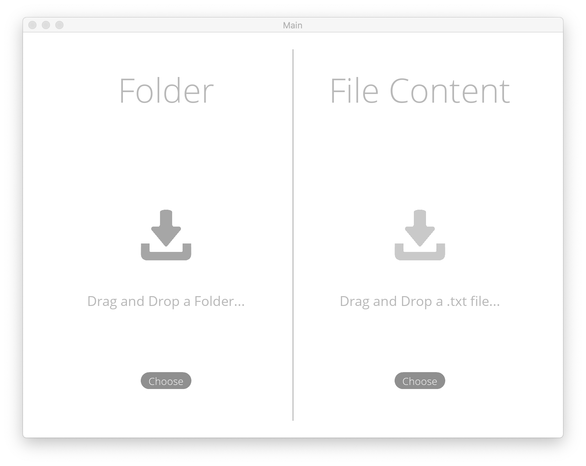

# Bulk File/Directory Spell Checker

> AstraZenica-Team029 (WIP)

## Description
To bulk spell check correction for misspelt directories and file names.

Created during the AstraZeneca Neurodiversity hackathon 2021.

### Challenge 1:
People that have dyslexia can have trouble relocating files and directories when they have misspelt them and the default file search does not find them.
The current way the challenge giver would go about this issue is by embedding metadata manually for each and every file so that the system search would pick it up. This process is a big hassle.

## Images

### Main Page



### File/Folder Name Correction


## Usage

Requires Python 3

Required modules:
- [pyspellchecker](https://pypi.org/project/pyspellchecker/)
- [kivy](https://kivy.org/#home)


Tested on:
- Windows
- MacOS

To run:
```
python main.py
```

Can drag and drop directories on the left hand side or choose it using a tkinter file browser window. It should show you the mispelt one's with corrections allowing you to rename them with one click.

# TODO

- Fix formatting/styling for second page
- Bulk spell checker for the content of files.
  - Interface is there for text files however functionality needs to be expanded.
- Having an option to traverse sub directories  
- multiple suggestions can be provided
  - `FileSpellChecker` is returning multiple suggestions however only one is being used for now.
-  While they are in the process of renaming the files, it would also give them the option to embedd meta-data into the file to help them relocate it later; it would also have spell checking for the metadata.
- Using an offline AI Powered spell checker to increase performance and provide better suggestion than `pyspellchecker`